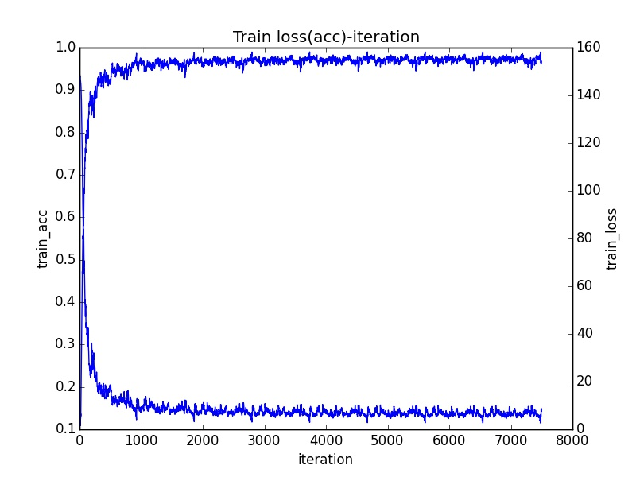
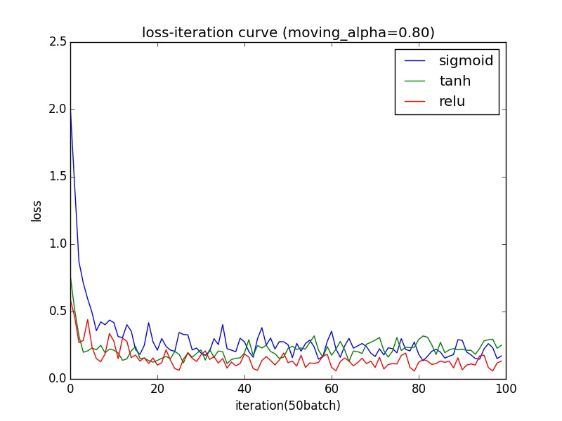
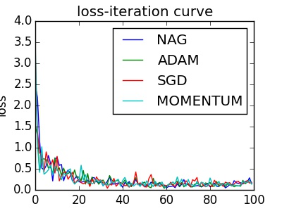
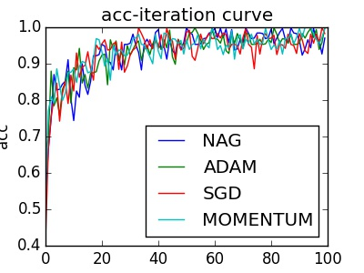

# 	CNN Inplementation With Numpy

​	复习深度学习相关知识。打算用numpy实现一个简单的可以训练，测试的cnn框架（model-free，model-based），包含一些主流的层和设计，以便复习与巩固基础。

**2018.01.22**

---

*Target1*:  （model-free）实现mnist的训练与测试：

* layer: Conv2D, FullyConnect, MaxPooling, Softmax 
* activation: Relu
* method: Mini-batch Gradient Descent(SGD)，learning_rate = 1e-5

| version      | validation_acc | train_acc | inferencetime(ms/pf) |
| :----------- | :------------: | :-------: | :------------------: |
| **baseline** |     96.75%     |  97.15%   |       2(ms/pf)       |

  

**2018.01.24**

------

*Target2*: 　(model-based)实现Variable与Operator分离设计：

* 完成Variable与Operator 类的设计与graph的注册功能，GLOBAL_VARIABLE_SCOPE作为全局所有Variable,Operator的索引(graph)，Operator,Variable类自己维护自己的child,parent列表。（感觉有点像tf）
* 完成Conv2D类的设计，对比上一版本进行测试通过。

~

**2018.01.25**

------

* 完成其他基本组件的Operator改写。新版本支持隐式构建graph，调用converge（汇） Variable.eval()自动完成前向传播计算；调用对应的source(源)Variable.diff_eval()自动完成反向传播与导数计算；对于learnable的Variable，手动调用Variable.apply_gradient()完成梯度下降。（未来目标把上述操作封转到显示的graph 或者session类中）

~

**2018.01.26**

------

*Target3*: 　实现不同的激活函数（relu系和sigmoid系)，比对分析：

* 给train_epoch读入图片添加了shuffle
* 完成了不同的激活函数relu,leaky-relu,sigmoid,tanh,elu, prelu
* 完成了对激活函数的grad_check,实际上sigmoid确实容易出现gradient-vanish,所以一开始用1e-5学习率基本收敛的特别慢，所以实际测试里面调整到了1e-3
* 初始化默认为init='MSRA', method和lr上没有做仔细的调整，最终的结果上比较性并不是特别强，但是我们可以明显发现sigmoid和tanh的计算速度要慢一些.relu系：50个batch的耗时1min13s左右。sigmoid系：1min30s左右，详细可以参考log，里面有准确的时间记录，都是同时在服务器上跑的。应该不存在资源上太大的区别。

| version                    | validation_acc | train_acc | learning_rate | epoch（max=20） |
| :------------------------- | :------------: | :-------: | :-----------: | :-----------: |
| **SGD_RELU** (alpha=0)     |     96.42%     |  96.85%   |     1e-5      |      11       |
| **SGD_LRELU**(alpha=0.01)  |     97.78%     |  97.22%   |     1e-5      |      17       |
| **SGD_LRELU**(alpha=0.001) |     97.98%     |  97.27%   |     1e-5      |      16       |
| **SGD_SIGMOID**            |     96.65%     |  95.61%   |     1e-3      |      16       |
| **SGD_TANH**               |     96.41%     |  91.12%   |   1e-3~1e-4   |       2       |
| **SGD_ELU**                |     97.74%     |  97.26%   |     1e-5      |      13       |

~

**2018.01.26**

------

由于我们没有精调参数，所以这里就不分析比较准确率曲线，我们就分析不同激活函数的收敛速度：

1. 左图可以看到tanh,sigmoid还是存在比较明显的gradient vanish，网络只有2层。即使采用了更大的学习率，在收敛速度上依然比relu要慢不少
2. 右图我们可以看到，这么多种relu,在收敛速度上，没有质的区别，即使是不同alpha的leak-relu（alpha=0.01,0.001），区别也不大。但是我们还是可以勉强认为leaky-relu稍微比relu强一些。

      

～

**2018.01.30**

------

由于不可抗力（～要给女友写论文做实验～），中断了几天。计划给Variable class添加method和initializer属性,用于全局控制变量的优化方法和初始化（这里就感觉到，应该抽象一个graph class,然后把Variable, Operator抽象成Node,方便控制全局的方法，例如初始化，优化方法设置，源求导，汇求值，全局apply_gradient等等，都可以变成graph的方法）。

原始的版本实现了SGD与MSRA.计划实现：

* method: sgd, momentum ,Nesterov, Adam ,RMSProp 等进行比对
* initializer: MSRA,  Xavier, Zeros, Const

ps:注意到之前的版本apply_gradient，diff都没有/batch_size,从这个版本添加上了.这样就收敛速度就不会显式的受到batch_size的影响(这个地方还是需要思考一下，因为从epoch角度来讲，不除比较稳定)。当然我就把初始learning_rate调大了50倍．同时，添加了util.learning_rate_decay,用于让学习率自动衰减,然而效果呵呵呵

～

**2018.02.01**

*method test on mnist*

| *learning_rate* | *batch_size* | *decay_rate* | *decay_epoch* | *initializer* |
| :-------------: | :----------: | :----------: | :-----------: | :-----------: |
|      5e-4       |      64      |     0.1      |       5       |     MSRA      |

| version  | val_acc(epoch1) | epoch2 | epoch3 | epoch4 | epoch4 |
| :------: | :-------------: | :----: | :----: | :----: | :----: |
|   SGD    |     92.66%      | 95.83% | 96.88% | 97.09% | 96.76% |
| Momentum |     92.12%      | 94.87% | 96.19% | 96.81% | 97.16% |
| Nesterov |     91.01%      | 94.90% | 96.45% | 96.76% | 97.11% |
|   Adam   |     91.73%      | 95.19% | 96.29% | 96.98% | 97.07% |

这里我们也一样比较了几种method在LRELU下的表现，由于初始化是随机的＋网络很浅，所以好像差别也不是特别明显，没有activation之间表现的差距那么明显。之后可能会在更深的网络上进行测试把,而且之后需要间隔短一点测试val。图片看起来很波动一方面在于gradient descent本来就是这样下降的，另外可能是记录的间隔有点尴尬。

     

